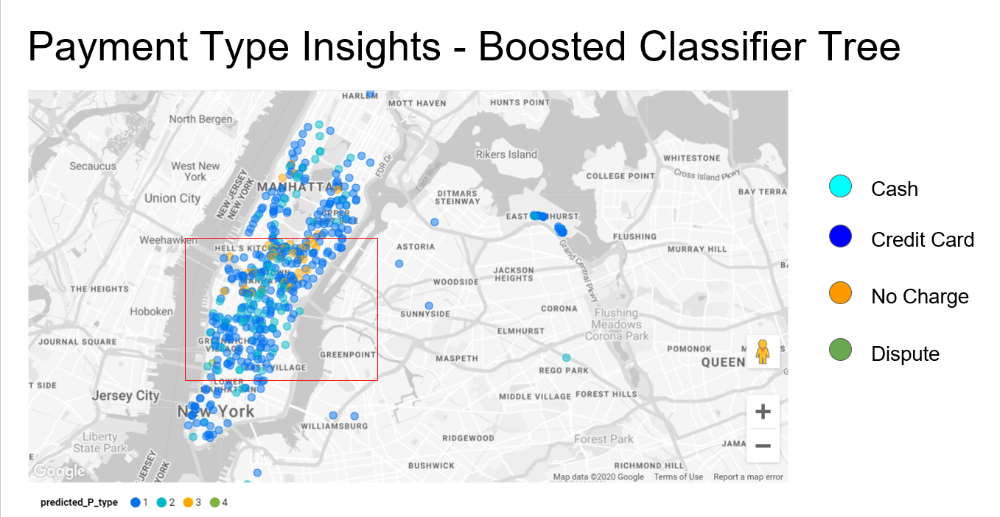
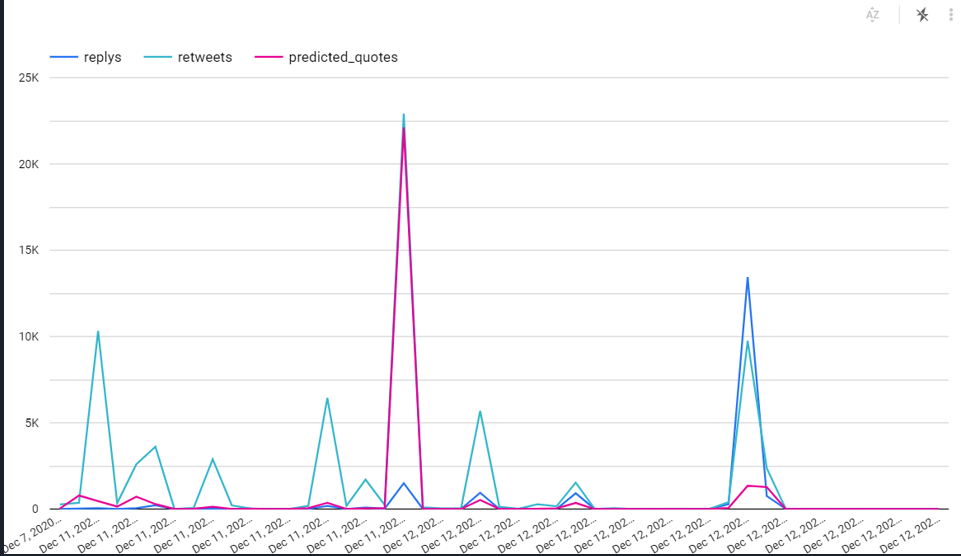
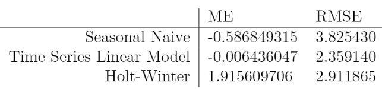
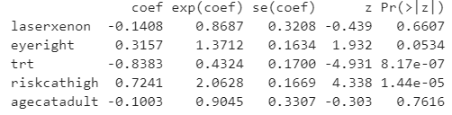
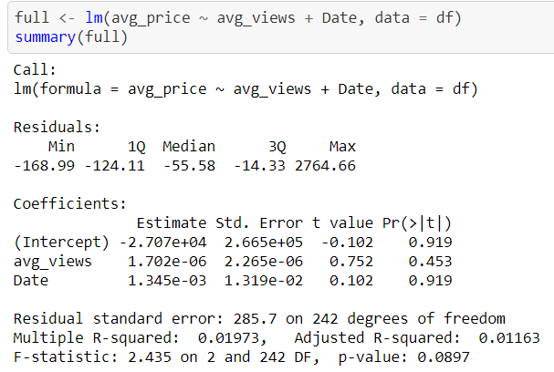
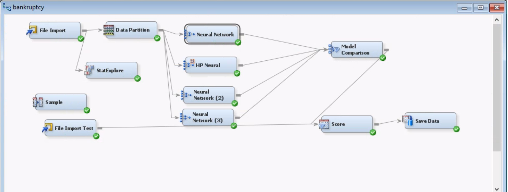

# Portfolio
Data Science Portfolio

---
# Google Cloud Platform (GCP) Projects

## [Project 1: Market Share Decrease Analysis of the NYC Yellow Cab](https://github.com/eerga/nyc_yellow_cab)

### Project Scope
Our Data Analytics team utilized GCP and Data Studio to conduct exploratory analysis (EDA) along with utilizing machine learning algorithms to identify areas of improvement for the Yellow Cab company and come up with suggestions that would increase its market share.

### ML Models
The two main machine learning models used were **Boosted Classifier Tree** and **Linear Regression**

### One of the key exploratory findings

Not only is it posisble to see that the highest activity of NYC Yellow Cab is in the Manhattan neighborhood but also that credit cards was the most utilized payment option.

### Summary of the project 
• Supervised statistical analysis on market share decrease of NYC Yellow Cab Company in Google Cloud Platform over 225 million records by running linear regression and boosted tree classifier models and visualizing in Data Studio  
• Recommended business strategies such as introducing a yellow cab app with more transparent fare calculations, flexible payment options and optimized route to lower driving costs

## [Project 2: Twitter & Plane Landing Correlation Assessment](https://github.com/eerga/twitter_flights)
### Project Scope
Google Cloud Platform (GCP) has real-time Twitter and flights datasets available. We decided to explore the possibility of correlation between the number of successfully landed commercial flights and overall Twitter activity. Assuming this hypothesis is proven, our team would have recommended Twitter to make a joint program with airlines using the hashtag #landedsafelywith[name_of_the_airline_company] to promote flights for specific airlines. As a result, this would create a mutually beneficial relationship between Twitter and the associated airline companies. Twitter would gain user traffic while airline companies are given free marketing material.

### Tools Used
The analysis was performed using **SQL** and **Python**. Since Twitter information is highly nested, this made defining schemas significantly more difficult on GCP. The Python script was used to extract the most relevant Twitter information. 

### ML Models
The main machine learning models used were Linear and Logistic Regressions

### One of the key exploratory findings
 
Even though we did observe activity spikes for both flights and Twitter, the activity spikes did not overlay, which means that other variable(s) may better explain Twitter activity increase. 

### Summary of the project 
The analysis suggests that our hypothesis should be rejected as this marketing strategy is not supported by available data. 

---
# R Projects
## [Project 1: Time Series Analysis of Minimum Temperatures in Melbourne, Australia](https://github.com/eerga/globalwarm)

### Project Scope
In this data, we have daily readings of minimum temperatures from Melbourne, Australia for 10 years (1981-1990). I was curious to see if any global warming trends would be visible on the 10-year scale. The reason for choosing minimum temperatures might not seem obvious, but I decided to play with those in order to observe extreme case of global warming. If minimum temperatures directly indicate presence of glabal warming, then we may need to do something before it is too late. I was also curious to see which of the models commonly used in time series forecasting would perform the best. The source code can be viewed in 3 formats: *.ipynb*, *.PDF*, and *.HTML*.

### Models Used
-Seasonal Naive  
-Time Series Model with Seasonality  
-Holt-Winter  

### Key Exploratory Figure
 
We normally use RMSE to evaluate model accuracy. Even though I expected for Holt Winter’s model to have the best performance, it turns out that a simpler time series linear model has the best performance. Seasonal naive was used as a base model. It is used for highly seasonal data and the forecasting accuracy might’ve not been as good as time series’ because the model uses the most recently observed value.

### Conclusions
Even though we learned a lot about the models, it wasn’t possible to conclude anything globalwarming tendencies. There are 2 possible reasons for this: 1). The range of data is not large enough. It might be more reasonable to obtain at least 50 years of minimum temperature readings and take a look at the data trend to make more appropriate conclusions; 2). While only Melbourne, Austria, was considered in the this analysis, it might be more effective to consider at lear 3 various locations to draw out a better conclusion.

## [Project 2: Survival Analysis of Patients with Diabetic Retinopathy](https://github.com/eerga/Survival_Analysis)

### Project Scope
In our study, we are interested in finding out which parameters contribute to the patient blindness and which do not. We used three methods to identify those parameters:
- **Kaplan-Meier Curve** (univariate analysis)
- **Log-rank test** (univariate analysis)
- **Cox Proportional-hazards model** (uni- and multivariate analysis)

### Key Exploratory Findings
 
- It was discovered that whether or not a patient received treatment was significant. Those who received treatment were 57% less likely to lose vision as those who did not receive treatment
- Those patients who were in the high risk category were 106% more likely to lose vision as those who are in the medium group.

### Suggestion
The age category group was not balanced as minors constituted 64% of the group and adults consituted the remaining 36%. The implementation of *ntile* would evenly distribute patients into two categories, which potentially can lead to different statistically significant results (i.e., age category might end up being significant). 

---
# Python Projects
## [Project 1: The Popularity Secret Behind Pokémon Card Resale Market](https://github.com/eerga/da_project)

### Goal
Our Data Analytics team assessed the influence of Pokémon YouTubers on Pokémon card resale. Our **hypothesis** was: the higher the YouYube views are, the higher the resale rate of Pokémon cards is. We web scraped historical data of Pokémon card prices and top 10 Pokémon YouTubers’ views, using Wayback Machine and Python  

### What we used
The packages we used are *Chromedrive* and *BeautifulSoup*.

### Project Conclusion
After conductig statistical analysis and building a descriptive model, we concluded that YouTube views solely cannot explain an increased popularity in Pokémon card resale and other features should be incorporated into the study.

The two main metrics used to derive the conclusion were p-value and R^2 score as demonstrated in the picture below

---
# SAS Project
## [Kaggle Competition - SAS](https://www.kaggle.com/c/fall2020-mgmt571lec-project/overview)

### Project Overview
Firm collapse prediction has been a subject of interests for almost a century and it still ranks high among hottest topics in economics. The aim of predicting financial distress is to develop a predictive model that combines various econometric measures and allows to foresee a financial condition of a firm. The purpose of the bankruptcy prediction is to assess the financial condition of a company and its future perspectives within the context of longterm operation on the market.

### Final Model

### Model Score
Our model accuracy achieve a score of 0.79 with the high-performance neural net
